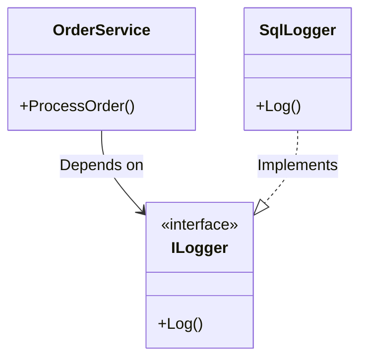

# Dependency Inversion Principle in .NET: A Practical Guide

## Intro: Why DIP Matters

Picture refactoring a legacy ASP.NET app where `OrderService` is tied to a database logger, killing unit tests. The Dependency Inversion Principle (DIP) fixes this by relying on abstractions, not implementations. .NET’s DI container makes it seamless. __TL;DR__: DIP decouples code for testability and flexibility—here’s how to apply it.

## DIP in Action

DIP ensures high-level modules (like business logic) don’t depend on low-level details (like logging). Instead, both rely on abstractions. Let’s see it in .NET:

### Without DIP: Tight Coupling

```csharp
public class OrderService {
    private SqlLogger _logger = new SqlLogger(); // Hardwired dependency
    public void ProcessOrder() => _logger.Log("Order processed");
}

public class SqlLogger {
    public void Log(string message) => Console.WriteLine(message); // DB logic
}
```
This locks `OrderService` to `SqlLogger`, making mocks impossible.

### With DIP: Decoupled

```csharp
public interface ILogger {
    void Log(string message);
}

public class OrderService {
    private readonly ILogger _logger;
    public OrderService(ILogger logger) => _logger = logger; // Inject abstraction
    public void ProcessOrder() => _logger.Log("Order processed");
}

public class SqlLogger : ILogger {
    public void Log(string message) => Console.WriteLine(message);
}
```

Register it in `Program.cs` with ASP.NET Core DI:

```csharp
builder.Services.AddScoped<ILogger, SqlLogger>();
```

Now OrderService works with any `ILogger` implementation, enabling mocks for testing.

## Why It Matters

DIP shines in .NET projects. Here’s why:

Benefit

How DIP Helps in .NET

Testability

Swap dependencies with mocks (e.g., using Moq) for unit tests.

Flexibility

Change loggers or data access without touching business logic.

Maintainability

Decouple components for cleaner, scalable ASP.NET Core apps.

## Visual Aid

This diagram shows DIP’s power:



Caption: `OrderService` depends on `ILogger`, not `SqlLogger`, enabling swaps.

## Quick Implementation Tips

- __Use Constructor Injection__: Pass dependencies via constructors, as shown above. It’s clear and aligns with ASP.NET Core’s DI.
- __Leverage .NET’s DI Container__: Register services in Program.cs for simple setups.
- __Explore IoC Containers__: For complex needs (e.g., named instances), try Autofac or Lamar. See Autofac docs for details.
- __Test Early__: Write unit tests to verify swappable dependencies, ensuring DIP’s benefits.

## Wrap-Up

DIP decouples .NET code, making it testable and adaptable. Use abstractions and .NET’s DI to streamline your apps. Try refactoring a small service today—swap a dependency and see the difference. Need more? Check .NET’s [DI docs](https://learn.microsoft.com/en-us/aspnet/core/fundamentals/dependency-injection) for advanced patterns.
